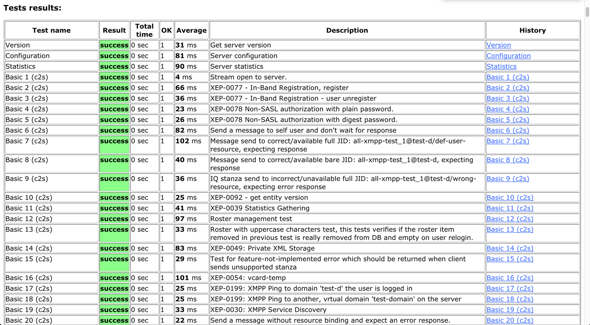

 /statusIcon)

# Tigase Testsuite [deprecated]

XMPP funcional test framework with sizeable suite of tests, currently superseeded by [Tigase TTS-NG](https://github.com/tigaseinc/tigase-tts-ng)

Current results for Tigase XMPP Server can be found on our pages: [Stable](https://build.tigase.net/tests-results/tts/) and [Snapshot](https://build.tigase.net/nightlies/tests/) releases

# Features

* Over 200 funcional XMPP tests:
  * Core XMPP (legacy socket and BOSH)
  * MultiUserChat
  * PubSub
  * Admin ad-hoc
* Easy, automatic operation
* Easy way to add more tests cases
* (Optional) Automatic preparaion of the database, supports:
  * MySQL
  * PostgreSQL
  * Derby
  * MongoDB
  * MS SQL Server

# How to Start

## Running

The whole suite execution can be handled via `$ ./scripts/all-tests-runner.sh` shell script. Executing it without any parameters will yield help:

```bash
$ ./scripts/all-tests-runner.sh
Run selected or all tests for Tigase server
----
Author: Artur Hefczyc
----
  --help|-h	This help message
  --func [mysql|pgsql|derby|mssql|mongodb]
              Run all functional tests for a single database configuration
  --lmem [mysql|pgsql|derby|mssql|mongodb]
              Run low memory tests for a single database configuration
  --perf [mysql|pgsql|derby|mssql|mongodb]
              Run all performance tests for a single database configuration
  --stab [mysql|pgsql|derby|mssql|mongodb]
              Run all stability tests for a single database
              configuration
  --func-all  Run all functional tests for all database
              configurations
  --lmem-all  Run low memory tests for all database
              configurations
  --perf-all  Run all performance tests for all database
              configurations
  --stab-all  Run all stability tests for all database
              configurations
  --all-tests Run all functionality and performance tests for
              database configurations
  --single test_file.cot
  --other script_file.xmpt
----
  Special parameters only at the beginning of the parameters list
  --debug|-d                 Turns on debug mode
  --skip-db-relad|-no-db     Turns off reloading database
  --skip-server|-no-serv     Turns off Tigase server start
  --small-mem|-sm            Run in small memory mode
-----------
  Other possible parameters are in following order:
  [server-dir] [server-ip]
```

You should copy `scripts/tests-runner-settings.dist.sh` to `scripts/tests-runner-settings.sh` and adjust settings before running.

## Adding new tests

To add new test you should create new test-case `.cot` file (it contains set of stanzas that are being send to server and expected results) and save it under `tests/data`. Subsequently you can run it using `--single` parameter.

Additionaly, you can create `.xmpt` file, which can group various test cases into suites, helping with variables substitions. 

Please refer to [Tigase Development Guilde: Tests](https://docs.tigase.net/tigase-server/master-snapshot/Development_Guide/html_chunk/tests.html) for details.

# Support

When looking for support, please first search for answers to your question in the available online channels:

* Our online documentation: [Tigase TTS-NG Docs](https://docs.tigase.net/tigase-server/master-snapshot/Development_Guide/html_chunk/tests.html)
* Our online forums: [Tigase Forums](https://help.tigase.net/portal/community)
* Our online Knowledge Base [Tigase KB](https://help.tigase.net/portal/kb)

If you didn't find an answer in the resources above, feel free to submit your question to either our 
[community portal](https://help.tigase.net/portal/community) or open a [support ticket](https://help.tigase.net/portal/newticket)

# Compilation 

It's a Maven project therefore after cloning the repository you can easily build it with:

```bash
mvn -Pdist clean install
```

# License

This is official <a href="https://tigase.net/">Tigase</a> Repository.
Copyright (c) 2013-2019 Tigase, Inc.

Licensed under AGPL License Version 3. Other licensing options available upon request.
